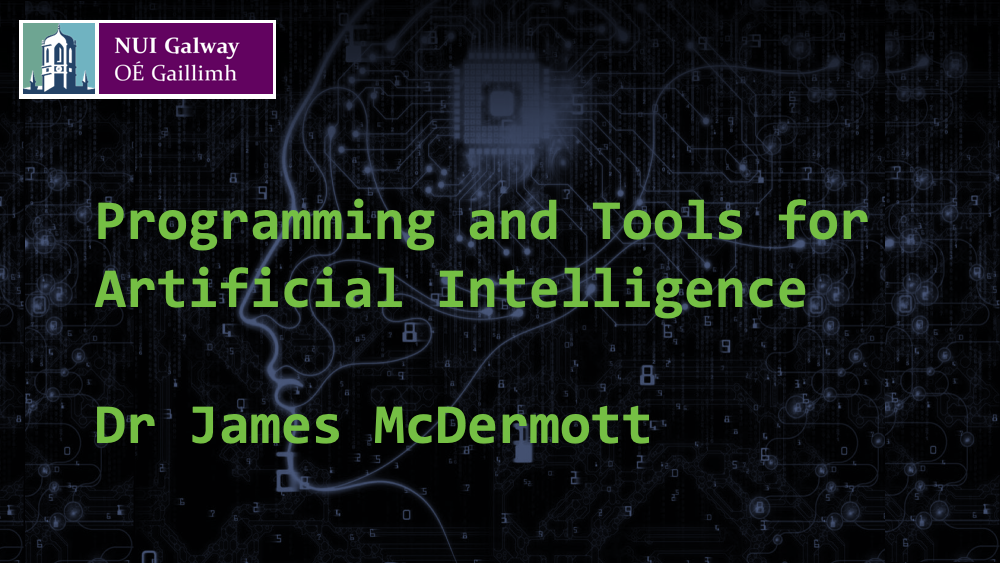
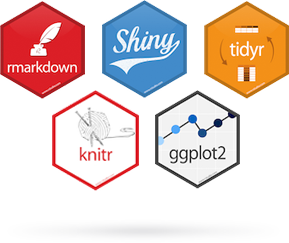

```{r setup, include=FALSE}
knitr::opts_chunk$set(echo = TRUE)
```


***

{width=100%}

&nbsp;

**Introduction to R**

## R

R is a language for statistical computing. It is based on an older, commercial language S. Like most of the software studied in this MSc, R is open-source. Research statisticians develop new algorithms in R because it is high-quality open-source. Professional data scientists use it because many statistical algorithms become available in R first, and because the ecosystem, especially tools like RStudio, R Markdown, ggplot, the tidyverse, and Shiny, are excellent.


{width=25%}
{width=30%}
{width=30%}


## R Ecosystem

* RStudio: a nice IDE for R
* R Markdown: a text-based format for writing reports with integrated R code, code outputs, and plots
* ggplot: best-in-class plotting
* The tidyverse: a collection of packages for manipulating data according to rational principles of "tidy data"
* Shiny: web-based dashboards

## Sources

* Our R lessons are based partly on Hadley Wickham's *R for Data Science* https://r4ds.had.co.nz

* We also draw on Dr Jim Duggan's NUI Galway module CT474

* The materials are written in "R Markdown". I'll distribute both the `.Rmd` source and the `.pdf` slide output. https://rmarkdown.rstudio.com/lesson-1.html

***

### Further reading

* Venables, Smith and the R Core Team, *An Introduction to R* https://cran.r-project.org/doc/manuals/r-release/R-intro.pdf
* Wickham, *Advanced R* https://adv-r.hadley.nz
* Kabacoff, *Quick-R* https://www.statmethods.net/

### Cheatsheets

* https://rstudio.com/wp-content/uploads/2015/03/ggplot2-cheatsheet.pdf
* https://rstudio.com/wp-content/uploads/2015/02/rmarkdown-cheatsheet.pdf
* https://rstudio.com/wp-content/uploads/2015/02/data-wrangling-cheatsheet.pdf
* https://rstudio.com/resources/cheatsheets/


## RStudio

"RStudio is an integrated development environment, or IDE, for R programming. Download and install it from http://www.rstudio.com/download." - R4DS


