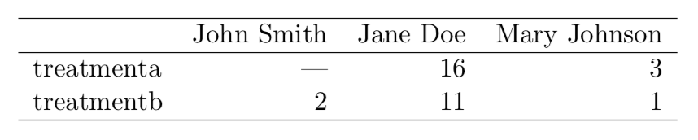

```{r setup, include=FALSE}
knitr::opts_chunk$set(echo = TRUE)
```

***

{width=100%}

&nbsp;

**Tidy Data in R**

## Tidy Data

* "Tidy Data" is a set of data-organising principles common in R.
* Proposed by Hadley Wickham, author of important R packages, recently won the 2019 COPSS President's Award ("the Fields medal of statistics").
* "when your data is tidy, each column is a variable, and each row is an observation".
* Much of this and the following R notebooks draw on Wickham's *R for Data Science* https://r4ds.had.co.nz.


## Base R and the Tidyverse

* The "Tidyverse" is the "Tidy data universe", a set of packages which try to adhere to tidy data principles.
* Tidyverse packages are all about working on *tibbles* (improved data frames), rather than vectors.
* The tidyverse packages provide new functionality and cleaner interfaces to existing functionality.
* "Base R" is the name used to mean R without the tidyverse packages.


## Installing and using packages

To install the Tidyverse packages, copy this code to your R Console in RStudio. 

```
> install.packages("tidyverse") 
```

&nbsp;

To actually use these packages, we have to import as follows: 

```{r}
library(tidyverse)
```

## `tibble`s are improved `data.frame`s

* In Base R, a `data.frame` is (as in Pandas) a data structure for rectangular data, with column headers -- a *table*
* A `tibble` is an improved dataframe for the tidyverse
* Docs: https://r4ds.had.co.nz/tibbles.html

## Converting a `data.frame` to a `tibble`

```{r}
d <- read.csv("data/mpg_extract.csv")
head(d, n=3) # just look at 3 rows
dt = as_tibble(d) 
head(dt, n=3)
```


## Why are tibbles named tibbles? 


## Making a tibble by hand: use `tribble`
```{r}
d = tribble(
  ~x, ~y, ~z, # here ~ indicates that these are formulas
  #--|--|----
  "a", 2, 3.6,
  "b", 1, 8.5
)
```

## Reading in a tibble

`read_csv` (not `read.csv`) is part of the Tidyverse `readr` package.

```{r}
d <- read_csv("data/prices.csv")
```

Friends include `read_tsv` (tab-separated) and `read_delimited` (more flexible).

In base R (i.e. not in the tidyverse), there is `read.csv`. Notice that `.` here is just part of the function name, not an operator. (Urgh!)

## Was everything read in ok?

```{r}
head(d) # take a quick look
```

## Was everything read in ok?
```{r}
glimpse(d) # another way of taking a quick look
```

## Manually specifying column types when reading
It looks as if `Date` has type `<chr>`. But R has a special date type.

```{r}
d <- read_csv("data/prices.csv", 
              col_types=cols(Date=col_date(
                format="%d/%m/%Y")))
head(d, n=3)
```

&nbsp; 

See https://r4ds.had.co.nz/data-import.html for more examples like this.


## Accessing subsets of a tibble

The `$` operator gets a named column as a vector:

```{r}
d$MSFT
```
## Accessing subsets of a tibble

Square brackets, name as string => 1-column tibble:

```{r}
d["MSFT"]
```

## Accessing subsets of a tibble

Square brackets and column number as int, same effect:

```{r}
d[2]
```

## Accessing subsets of a tibble

Square brackets and "slice" -- select several columns of d:

```{r}
d[2:4]
```


## Accessing subsets of a tibble

Get the first 10 rows of MSFT column:

```{r}
d$MSFT[1:10]
```


## Non-tidy data (1)

{width=70%}


## Non-tidy data (2)

{width=85%}


## Tidy Data

{width=70%}


## "In tidy data... 
Every value belongs to a variable and an observation. [...]

1. Each variable forms a column.
2. Each observation forms a row.
3. Each type of observational unit forms a table.

This is Codd's 3rd normal form" -- R4DS

>- *Is it?* (See `code/tidy_data.xlsx`)


## Forms of data

* Tidy Data versus Codd's 3rd Normal Form (3NF), studied in database theory
* Tidy Data versus analytical base table (ABT)
* Some theory: http://www.jstatsoft.org/v59/i10/paper.

## Analytical base table

A DB in 3NF has multiple tables and no repetition of data. An ABT is one table with repetition and derived data. (Image from SAS).

{width=80%}


## Why Tidy Data?

* Consistent underlying structure => consistent tools (`ggplot`, `dplyr`, etc.) => easier to learn
* Suits R's vectorisation

Another important motivation: if they are regularly queried together, we gain ease of querying. We may lose efficiency of storage, may re-introduce potential anomalies (relative to 3NF).


## `gather`


```
gather(table4b, key="year", value="cases", c("1999", "2000"))
```


## `spread`


```
spread(table2, key="key", value="value")
```


## Some more tidying functions

* `separate`: separate a column which encodes two variables into two columns, e.g. `name` "James McDermott" -> `first_name` "James", `second_name` "McDermott"
* `unite`: the opposite
* `complete`: add missing rows (and use `NA` as the missing value)

## Exercises

1. Recall our experiment on running time for sorting an array of different sizes. The original data (before we added extra columns) is available in `data/sort_times_original.csv`. Read it in to a `tibble`. (You might need to set the working directory first.)
2. Use `glimpse` to take a look. What types do the columns have?
3. In what way is this *not* tidy data? Use `gather` to fix it. Hint: the result should have shape 50 x 3 with columns `n`, `run_number`, `run_time`.
4. It would be nicer if `run_number` was just an integer, eg `0`, instead of `run0`. Use `separate` to split it into two parts. Hint: use `into=c("dummy", "run_number")`. 
5. Look again at the result. We don't need that "dummy" column. Use `NA` to omit it. Hint: see `?separate` for help on `into`.
6. Look again -- `run_number` is still not an integer! Fix this. Hint: `separate` can guess the correct type to convert to, but see `?separate` again to see how to ask it to.
7. Write it to a file `data/sort_times_tidy.csv` using `write_csv()`.

## Solutions

## Exercise 1

```{r}
d <- read_csv("data/sort_times_original.csv") 
```

## Exercise 2

```{r}
glimpse(d) # All columns of type `dbl`, which is ok
```

## Exercise 3

```{r}
d <- gather(d, key="run_number", value="run_time", 
            run0, run1, run2, run3, run4) 
```

## Exercise 4

```{r}
separate(d, run_number, 
         into=c("dummy", "run_number"), sep=3) 
```

## Exercise 5

```{r}
separate(d, run_number, 
         into=c(NA, "run_number"), sep=3) 
```

## Exercise 6

```{r}
d <- separate(d, run_number, 
              into=c(NA, "run_number"), sep=3, 
              convert=TRUE)
d
```

## Exercise 7
```{r}
write_csv(d, "data/sort_times_tidy.csv")
```