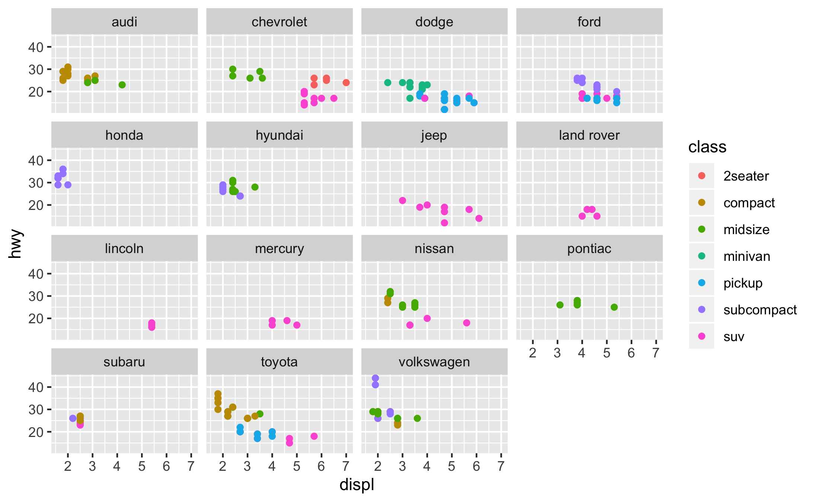

```{r setup, include=FALSE}
knitr::opts_chunk$set(echo = TRUE, fig.height = 2.5, fig.width = 4, fig.align = "center")
```

***

{width=100%}

&nbsp;

**Plotting in R**

## Plotting in R

Plotting is a central part of the data analysis loop. `ggplot2` is a great library that works well with `dplyr` and the rest of the Tidyverse.

```{r}
library(tidyverse)
```

## Example (`mpg` dataset)

We previously saw a small extract of this dataset `data/mpg_extract.csv`. The full dataset is built-in to the `ggplot2` library.

```{r}
dt <- ggplot2::mpg 
dt
```

## Example (`mpg` dataset)

Do cars with big engines use more fuel than cars with small engines?

Among the variables are:

*  `displ`, a car's engine volume ("displacement") in litres 
*  `hwy`, a car's fuel efficiency on the highway in miles per gallon

## Scatterplot using `geom_point`

The library is called `ggplot2`, but the function is called `ggplot`.

```{r}
ggplot(data = dt) +
  geom_point(mapping = aes(x=displ, y=hwy))
```

## Seeing/saving

* In R Studio, the plot appears in the bottom-right panel. 
* If editing R Markdown, it appears inline.
* If we want to save:
```{r}
ggsave("img/mpg_test.png")
```

## General recipe for `ggplot`
```
ggplot(data = <DATA>) +
  <GEOM_FUNCTION>(mapping = aes(<MAPPINGS>))
```


## The Grammar of Graphics

* Wilkinson, L. (2005), The Grammar of Graphics (2nd ed.). Statistics and Computing, New York: Springer.

* Wickham calls it "The most important modern work in graphical grammars"

* Every graph: a data set, a coordinate system, and visual marks representing data

* Wickham wrote the `ggplot2` package, an implementation of the grammar of graphics, which is used by most R practitioners.

## `ggplot2` concepts

* Layers
* Aesthetic mappings
* Geometric objects


## Layers

We can create a blank plot with something like this. 

```{r}
ggplot(mpg)
```

## Aesthetics

`aes` says what variable maps to what aesthetic property e.g. colour, or position on an axis. It still doesn't have any *layers*. (Notice it is allowed to put `aes` inside `ggplot`.)

```{r}
ggplot(mpg, aes(x=displ, y=hwy))
```


## geoms

A *geom* is a way of translating a value to marks in the plot. We write `+ geom`, and **that adds a layer**. 

```{r}
ggplot(data = dt) +
  geom_point(mapping = aes(x=displ, y=hwy))
```


## Adding an extra aesthetic

```{r}
ggplot(data = dt) +
  geom_point(mapping = aes(x=displ, y=hwy, colour=class))
```


## More geoms

There are several different geoms. 
We already saw `geom_point`. Next, we'll look at how we can change appearance.
```{r}
ggplot(mpg, aes(x=hwy, y=cty)) +
  geom_point()
```

## More geoms

```{r}
ggplot(mpg, aes(x=hwy, y=cty)) +
  geom_density2d()
```

## Multiple geoms

We can just write `+` to add multiple geoms to a plot (i.e. multiple layers).

```{r}
ggplot(mpg, aes(x=hwy, y=cty)) +
  geom_density2d() + geom_point()
```


## Faceting
Maybe a nicer way is instead to split the data into one graph per class.

```{r}
ggplot(data = dt) +
  geom_point(mapping = aes(x=displ, y=hwy)) +
  facet_wrap(~class) # notice tilde ~ for a *formula*
```

Notice that `facet_wrap` preserves the x and y axes scales across all facets.


## Adding another variable

Another variable is `manufacturer`. We are now showing 4 variables.
```{r}
ggplot(data = dt) +
  geom_point(mapping=aes(x=displ, y=hwy, colour=manufacturer)) +
  facet_wrap(~class)
```


## New variables

We can create a new variable inside the `aes` call.

## New variables

Which car types emphasise city fuel efficiency over highway fuel efficiency?
```{r}
ggplot(mpg, aes(x=class, y=cty/hwy)) +
  geom_boxplot()
```


## `dplyr` with `ggplot`
We can pipe the output of some `dplyr` manipulation straight into `ggplot` and then use aesthetics and `geom` commands to refine the plot. 

## `dplyr` with `ggplot`

```{r}
mpg %>% group_by(class) %>%
  summarise(count=n(),
    av_hwy=mean(hwy),
    av_cty=mean(cty)) %>%
  ggplot(mapping = aes(x=av_hwy, y=av_cty)) +
  geom_point(aes(size=count), alpha=0.5)
```


## Collision modifiers

These are methods of preventing marks (e.g. dots) from overlapping with each other. 

* `dodge` ("smart" displacement of dots)
* `jitter` (random displacement of dots)
* `nudge` (manual displacement of dots)

There's an example with `nudge` in Assignment 2.


## More references

* Manual https://ggplot2.tidyverse.org/reference/
* Cheatsheet https://github.com/rstudio/cheatsheets/blob/master/data-visualization-2.1.pdf
* BBC using R for data journalism with a "house style" https://medium.com/bbc-visual-and-data-journalism/how-the-bbc-visual-and-data-journalism-team-works-with-graphics-in-r-ed0b35693535


## Exercises

Here are a few plots from well-known datasets. The exercise is to reproduce them using `ggplot`

## Exercise 1

Character height in Star Wars using a "violin plot". A violin plot is like a sideways, smoothed histogram, or like a box plot.

The dataset is `dplyr::starwars`.
```{r, echo=FALSE, fig.height = 2, fig.width = 4, fig.align = "center"}
s = dplyr::starwars
s %>% select(height, mass, species) %>% 
  filter(height != "na.rm") %>% 
  filter(species %in% c("Human", "Droid")) %>% 
  ggplot(mapping=aes(x=species, y=height)) + geom_violin()
```
## Exercise 2
Character height and mass in Star Wars, with trendlines.
```{r, echo=FALSE, fig.height = 2.5, fig.width = 4, fig.align = "center"}
s %>% filter(species == "Human" | species == "Droid") %>% ggplot(aes(x=height, y=mass, color=species)) + geom_point(alpha=0.5) + geom_smooth(method=lm, se=FALSE)
```


## Exercise 3

Eruption length versus waiting time at the Old Faithful geyser. The dataset is `faithful`, built-in to R as a `data.frame`. Recall we can use `as_tibble` to convert to a tibble. Hint: this is called a "rug plot".
```{r, echo=FALSE, fig.height = 2.5, fig.width = 4, fig.align = "center"}
f = as_tibble(faithful)
f %>% ggplot(aes(x=eruptions, y=waiting)) + geom_point() + geom_rug()
```

## Exercise 4
Like a previous plot, but now faceting `manufacturer` and showing `class` as colour.

{width=85%}

## Solutions

## Exercise 1
```
s = dplyr::starwars
s %>% select(height, mass, species) %>% 
  filter(height != "na.rm") %>% 
  filter(species %in% c("Human", "Droid")) %>% 
  ggplot(mapping=aes(x=species, y=height)) + geom_violin()
```

## Exercise 2
```
s %>% filter(species == "Human" | species == "Droid") %>% 
  ggplot(aes(x=height, y=mass, color=species)) + 
  geom_point(alpha=0.5) + geom_smooth(method=lm, se=FALSE)
```

## Exercise 3
```
f = as_tibble(faithful)
f %>% ggplot(aes(x=eruptions, y=waiting)) 
  + geom_point() + geom_rug()
```

## Exercise 4
```
dt <- ggplot2::mpg 
ggplot(data = dt) +
  geom_point(mapping = aes(x=displ, y=hwy, colour=class)) +
  facet_wrap(~manufacturer)
ggsave("img/R_mpg_displ_hwy_manu_class.png")
```

